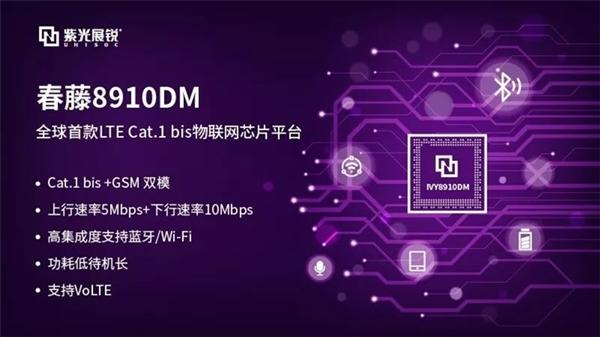
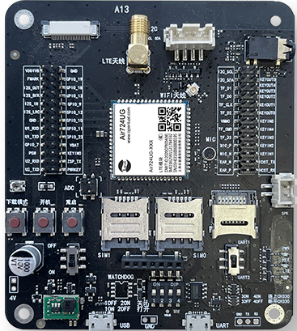

# [UIS8910DM](https://github.com/SoCXin/UIS8910DM)

* [unisoc](https://www.unisoc.com/)：[Cortex-A5](https://github.com/SoCXin/Cortex)
* [L7R5](https://github.com/SoCXin/Level)：500 MHz

## [简介](https://github.com/SoCXin/UIS8910DM/wiki)

[UIS8910DM](https://github.com/SoCXin/UIS8910DM) 采用28nm成熟工艺，是全球首颗LTE Cat.1 bis芯片，支持LTE Cat.1bis和GSM双模，上行速率达5Mbps，下行速率达10Mbps，并拥有高集成度，同时集成了蓝牙通讯和Wi-Fi室内定位，可实现更稳定的连接，支持VoLTE，同时通过系统优化设计，使得春藤8910DM可实现显著的低功耗优势。

#### 关键特性

* 500 MHz Cortex-A5 内核
* LTE-TDD：Band B34/B38/B39/B40/B41;
* LTE-FDD：Band B1/B3/B5/B8;
* GSM：900/1800
* 集成多个标准接口USB/SDIO
* 蓝牙 4.2，支持 BLE
* 只 WiFi Scan 功能，辅助定位

### [资源收录](https://github.com/SoCXin)

* [参考资源](src/)
* [参考文档](docs/)
* [参考工程](project/)

### [选型建议](https://github.com/SoCXin)

[UIS8910DM](https://github.com/SoCXin/UIS8910DM) 是高性价比LTE Cat.1，和前代[RDA8810](https://github.com/SoCXin/RDA8810) GSM SoC使用A5内核，随着openCPU 方案AIR 724系列 [openluat](https://doc.openluat.com/article/103/0) 被广泛应用。

UIS8910DM 主要的竞品为Cortex-R5内核[ASR1601](https://github.com/SoCXin/ASR1601)，后者对应典型模组为 EC600系列

#### 相关开发板

### [探索芯世界 www.SoC.xin](http://www.SoC.Xin)
